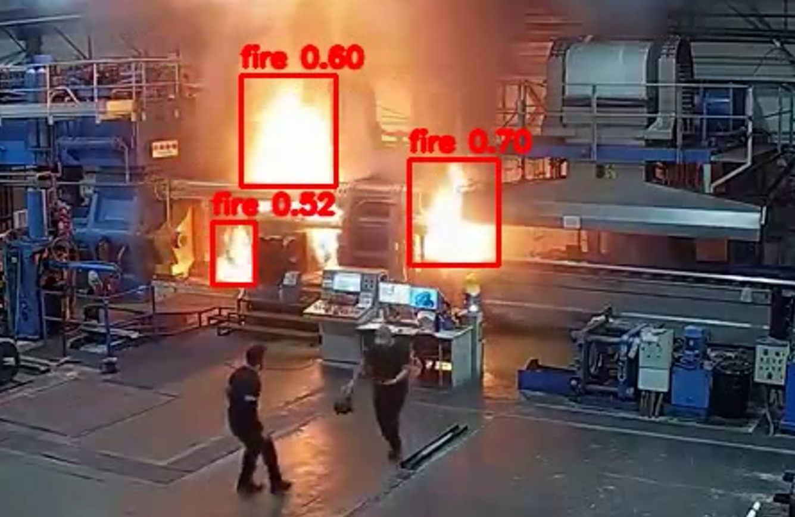
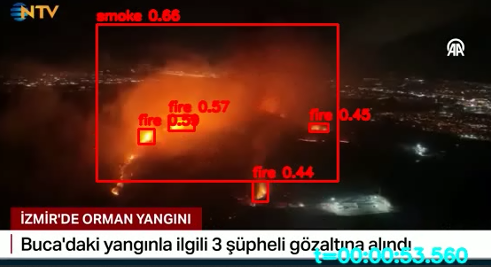

# yolo-fire-and-smoke-detection

**Dataset Linki:**
https://onedrive.live.com/?redeem=aHR0cHM6Ly8xZHJ2Lm1zL3UvYy9jMGJkMjViNmIwNDhiMDFkL0ViTGdEN2JFUzRGRHZVTjM3R3J4bjhRQkY1Z0lCQmM3WVYycWtsRjA4R0NpQnc&cid=C0BD25B6B048B01D&id=C0BD25B6B048B01D%21sb60fe0b24bc44381bd4377ec6af19fc4&parId=C0BD25B6B048B01D%21s5fbfa581fdbb4699aaf29d8b5aee948d&o=OneUp

**Kurulum:**
Ana klasörde `images` adında klasör oluşturup, linkteki zip dosyasının içinde bulunan `test` ve `train` klasörlerini bu `images` klasörüne atınız.

---

## Verisetinin İstatistikleri

### Resim Sayıları

| Category | # Images |
| :--- | :--- |
| Only fire | 1,164 |
| Only smoke | 5,867 |
| Fire and smoke | 4,658 |
| None | 9,838 |

### Etiketli Nesne Sayısı

| Class | # Bounding boxes |
| :--- | :--- |
| Fire | 14,692 |
| Smoke | 11,865 |

## Performans Metrikleri

Eğitim sonucunda elde edilen doğruluk (Precision), duyarlılık (Recall) ve mAP değerleri şu şekilde:

### Eğitim Sonuçları (64 Epoch)
* **Süre:** 3.5 saat
* **Donanım:** NVIDIA GeForce RTX 4060 Laptop GPU
* **Model:** YOLO11n (100 layers, 2,582,542 parameters)

| Class | Images | Instances | Precision (P) | Recall (R) | mAP50 | mAP50-95 |
| :--- | :--- | :--- | :--- | :--- | :--- | :--- |
| **all** | 4302 | 5186 | 0.772 | 0.704 | 0.775 | 0.453 |
| **smoke** | 2077 | 2311 | 0.828 | 0.787 | 0.845 | 0.526 |
| **fire** | 1113 | 2875 | 0.716 | 0.621 | 0.705 | 0.380 |

---

## Tespit Sonuçlarından Örnek Görüntüler

Modelin farklı senaryolarda yaptığı tespitlere (bounding box çizimleri) ait örnek ekran görüntüleri:

### Örnek 1

### Örnek 2

